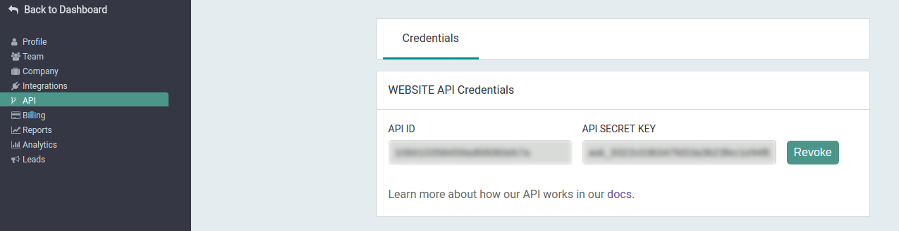

# Riminder Api Java

-------------------------------------

A java api client for riminder api.

## Instalation with maven
Put the following in your pom.xml
```xml
 <dependency>
  <groupId>net.riminder.riminder</groupId>
  <artifactId>riminder</artifactId>
  <version>0.0.2</version>
</dependency>
```

## Authentification
To authenticate against the api, get your API SECRET KEY from your riminder dashboard:


Then create a new `Riminder` object with this key:
```java
import net.riminder.riminder.Riminder;

// Authentification to api
Riminder client = new Riminder("yoursecretkey");

// Finally you can use the api!!.
```

## Api Overview
```java
import net.riminder.riminder.response.Token;
import net.riminder.riminder.Riminder;

Riminder client = new Riminder("some-key");

// Let's retrieve a profile.
Map<String, Token> profile = client.Profile().get("source_id", new Ident.Reference(Ident.Profile, "reference_for_a_profile"));

// And print his name !
System.out.println("This profile name is: ");
System.out.println(profile.get("name").as<String>());
```

## Token
`Riminder`'s methods usualy return a `net.riminder.riminder.response.Token` object in a Collection.

A `Token` store the value of response fields, which can be access by using the `<T>as()` method.
For example:
```java
import net.riminder.riminder.response.Token;

// Response -> {"name": "Natalie Test", "languages": ["french", "spanish"]}
Map<String, Token> response = create_test_response();

// Print the name.
System.out.println(response.get("name").<String>as());

// Print languages
for (Token lang: response.get("languages").asList())
    System.out.println(lang.<String>as());
```

## Errors
If an error occurs while an operation an exception inherited from `net.riminder.riminder.exp.RiminderException` is raised.

## Api
The mentionned team is the team linked to your secret key.

-------------------

`_ident` can be filled by both a `Ident.Reference` or `Ident.ID` object. These object represent a `*_reference` or a `*_id` field.
For example:
```java
// Let's create a profile_id.
Ident profile_id = new Ident.ID(Ident.Profile, "a profile id");
// or a filter_reference
Ident filter_reference = new Ident.Reference(Ident.Filter, "a filter_reference");
```
---------------

Only the `data` field is returned.

-------------

For details and examples see [our documentation](https://developers.Riminder.net/v1.0/reference).

### Filter

* Get all filters from the team.
```java
List<Token> resp = client.Filter().list();
```

* Get a specific filter.
```java
Map<String, Token> resp = client.Filter().get(filter_ident);
```

More details about filters are available [here](https://developers.Riminder.net/v1.0/reference#jobs)

### Profile

* Retrieve the profiles information associated with specified source ids.
    * listOptions type is `net.riminder.riminder.route.Profile.Listoptions`
        * a filled `source_ids` is required.

```java
Map<String, Token> resp = client.Profile().list(listOptions);
```
Listoptions class:
```java
    public class Listoptions
    {
        public List<String> source_ids;
        public String seniority;
        public String filter_id;
        public String filter_reference;
        public String stage;
        public Integer rating;
        public Long date_start;
        public Long date_end;
        public Integer page;
        public Integer limit;
        public String sort_by;
        public String order_by;
    }
```

* Add a new profile to a source on the platform.
    * `source_id` and `file_path` are *required*
    * `file_path` is the path to the file to be uploaded.
    * `training_metadatas` type is `List<TrainingMetadata>`

```java
Map<String, Token> resp = client.Profile().add(source_id, file_path, profile_reference, timestamp_reception, training_metadatas);
```

* Get a specific profile.
```java
Map<String, Token> resp = client.Profile().get(source_id, profile_ident);
```

* Get attachements of a specific profile.
```java
List<Token> resp = client.Profile().Document().list(source_id, profile_ident);
```

* Get parsing result of a specific profile.
```java
Map<String, Token> resp = client.Profile().Parsing().get(source_id, profile_ident);
```

* Get scoring result of a specific profile.
```java
List<Token> resp = client.Profile().Scoring().list(source_id, profile_ident);
```

* Reveal interpretability result of a specific profile with a specific filter.
```java
Map<String, Token> resp = client.Profile().Revealing().get(source_id, profile_ident, filter_ident);
```

* Set stage of a specific profile for a specified filter.
    * `stage` is required.
```java
Map<String, Token> resp = client.Profile().Stage().set(source_id, stage, profile_id, profile_reference, filter_id, filter_reference);
```

* Set rating of a specific profile for a specified filter.
    * `rating` (`int`) is required.
```java
Map<String, Token> resp = client.Profile().Stage().set(source_id, rating, profile_id, profile_reference, filter_id, filter_reference);
```

* Check if a parsed profile is valid.
    * `profile_data` (`net.riminder.riminder.route.Profile.ProfileJson`) is the parsed profile you want to check, can be called "profile_json".
    * `training_metadata` type is List<TrainingMetadata> (`net.riminder.riminder.route.Profile.TrainingMetadata`)
```java
Map<String, Token> resp = client.Profile().Json().check(profile_data, training_metadata);
```

* Add a parsed profile to a source on the platform.
    * `profile_data` (`net.riminder.riminder.route.Profile.ProfileJson`) is the parsed profile you want to add, can be called "profile_json".
    * `training_metadata` type is List<TrainingMetadata> (`net.riminder.riminder.route.Profile.TrainingMetadata`)
```java
Map<String, Token> resp = client.Profile().Json().add(source_id, profile_data, profile_reference, timestamp_reception, training_metadata);
```

More details about profiles are available [here](https://developers.Riminder.net/v1.0/reference#profile)

### Sources

* Get all source from the team.
```java
List<Token> resp = client.Source().list();
```

* Get a specific filter.
```java
Map<String, Token> resp = client.Source().get(source_id);
```

More details about profiles are available [here](https://developers.Riminder.net/v1.0/reference#source)

### Webhooks

Webhooks methods permit you handle webhook events.

* Check if team's webhook integration is working.
```java
Map<String, Token> resp = client.Webhooks().check();
```
* Set an handler for a specified webhook event.
    * `handler` type is `net.riminder.riminder.route.Webhooks.MessageHandler`
        * data received by the webhook are store in `webhook_data`.
        * `webhook_data` is a `Map<String, Token>`.
        * `eventName` is `type` field of the webhook.

MessageHandler:
```java
public static interface MessageHandler
{
    public void handle(String eventName, Map<String, Token> webhook_data);
}
```

```java
client.Webhooks().setHandler(eventname, handler);
```
* Check if there is an handler for a specified event
```java
client.Webhooks().isHandlerPresent(eventName);
```
* Remove the handler for an event
```java
client.Webhooks().removeHandler(eventName);
```
* Start the selected handler depending of the event given.
    * `signatureHeader` is webhook request "HTTP-RIMINDER-SIGNATURE" header value.
```java
client.Webhooks().handle(headers, signatureHeader)
```
Example:
```java
import net.riminder.riminder.Riminder;
import net.riminder.riminder.response.Token;
import net.riminder.riminder.route.Webhooks;
import net.riminder.riminder.route.Webhooks.MessageHandler;

public class Example
{
    public static void main( String[] args ) {
        Riminder client = new Riminder("apikey");

        // Define an handler
        MessageHandler handler = new MessageHandler(){

            @Override
            public void handle(String eventName, Map<String, Token> webhook_data) {
                // some treatment
            }
        };


        // Set the handler for an event
        client.Webhooks().setHandler(Webhooks.EventNames.PROFILE_PARSE_SUCCESS, handler);

        // Get the header of the request by webhook
        Map<String, String> rcvheaders = fct_that_get_webhook_request();

        // Handle an event
        client.Webhooks().handle(headers: rcvheaders.get("HTTP-RIMINDER-SIGNATURE"));
    }
}
```

More details about webhooks are available [here](https://developers.Riminder.net/v1.0/reference#authentication-1)

## Tests

Some tests are available. To run them follow these steps:
* `git clone git@github.com:Riminder/java-riminder-api.git`
* `cd java-riminder-api/riminder.Tests`
* `...`

## Help and documentation
If you need some more details about the api methods and routes see [Riminder API Docs](https://developers.Riminder.net/v1.0/reference).

If you need further explainations about how the api works see [Riminder API Overview](https://developers.riminder.net/v1.0/docs/website-api-overview)
